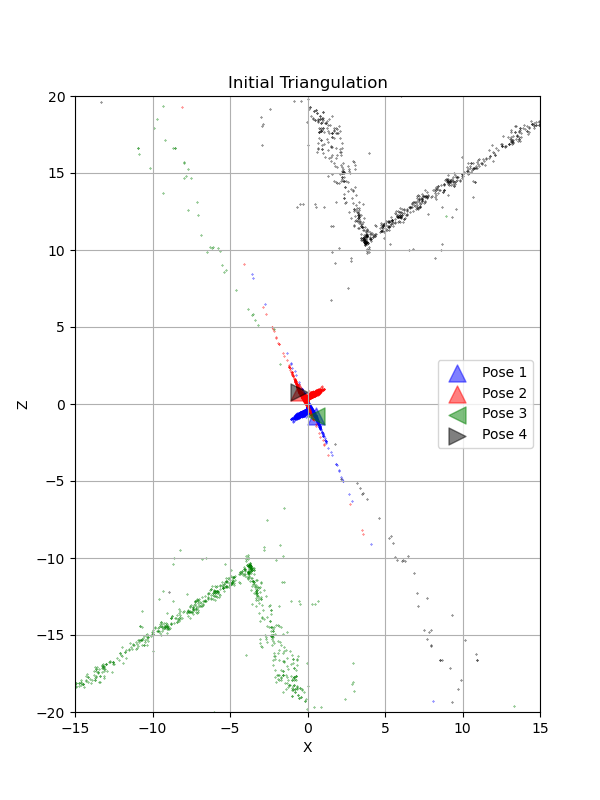
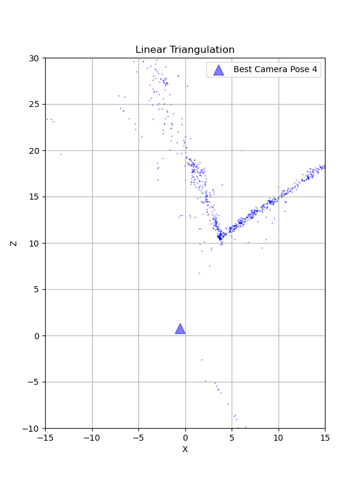

# SfM-Buildings-built-in-minutes
In this project, we implement a traditional Approach to the Structure from Motion algorithm that reconstructs a 3D scene and simultaneously obtains the camera poses of a monocular camera w.r.t. the given scene. Create the entire rigid structure from a set of images with different viewpoints (or equivalently a camera in motion).

The steps that collectively form SfM:
* Feature Matching and Outlier rejection using RANSAC
* Estimating Fundamental Matrix
* Estimating Essential Matrix from Fundamental Matrix
* Estimate Camera Pose from Essential Matrix
* Check for Cheirality Condition using Triangulation
* Perspective-n-Point
* Bundle Adjustment


## Dataset
The data given are a set of 6 images of the building in front of Levine Hall at UPenn, using a GoPro Hero 3 with fisheye lens distortion corrected. Keypoints matching (SIFT keypoints and descriptors used) data is also provided for pairs of images.

The images are taken at 1280 × 960 resolution and the camera intrinsic parameters K are given in calibration.txt file.

## Project Overview


The figure above shows the overview of the SfM algorithm. First, we implement feature matching and reject outliers by estimating the optimized fundamental matrix using RANSAC.

From here, the Essential matrix can be extracted from the Fundamental matrix. Additionally, four possible camera poses (consisting of 6 degrees-of-freedom (DOF) Rotation (Roll, Pitch, Yaw), and Translation (X, Y, Z) of the camera with respect to the world) can be estimated from the essential matrix.

We triangulate the 3D points using linear least squares to find the correct unique camera pose. This can help us remove the disambiguity and is called "Cheirality Condition Check". Then implement nonlinear triangulation to minimize the reprojection error by nonlinear optimization functions such as least square.

Now, since we have a set of n 3D points in the world, their 2D projections in the image, and the intrinsic parameter K; the 6 DOF camera pose can be estimated using linear least squares. This fundamental problem, in general, is known as Persepective-n-Point (PnP). In this project, we have implemented a simple version of PnP to register a new image given 2D-3D correspondence.

Last, since we have computed all camera poses and 3D points, we refined the poses and 3D points together, initialized by previous reconstruction by minimizing reprojection error which can be achieved by bundle adjustment.

## Usage 
To run the SfM algorithm, you can use the following command.
```
python3 Wrapper.py --DataPath {Path to the images folder} --CalibPath {Path to the calibration txt file}
```
The code will generate four images: initial four camera poses, 3D points and poses after linear triangulation, nonlinear triangulation, and final sparse bundle adjustment.

## Visualization
The figures below have shown the reconstruction of initial linear triangulation and four possible camera poses, the disambiguate camera pose, the comparison of linear and nonlinear triangulation, and the final reconstructed 3D points of sparse bundle adjustment.

|  | 
|:--:| 
| *Correspondence between images 1 and 2 after rejecting outliers.* |

|  | 
|:--:| 
| *Initial triangulation plot with disambiguity, showing all four possible camera poses.* |

|  | 
|:--:| 
| *Unique camera pose after checking the cheirality condition.* |

|  | 
|:--:| 
| *The final reconstructed scene after Sparse Bundle Adjustment (SBA).* |

